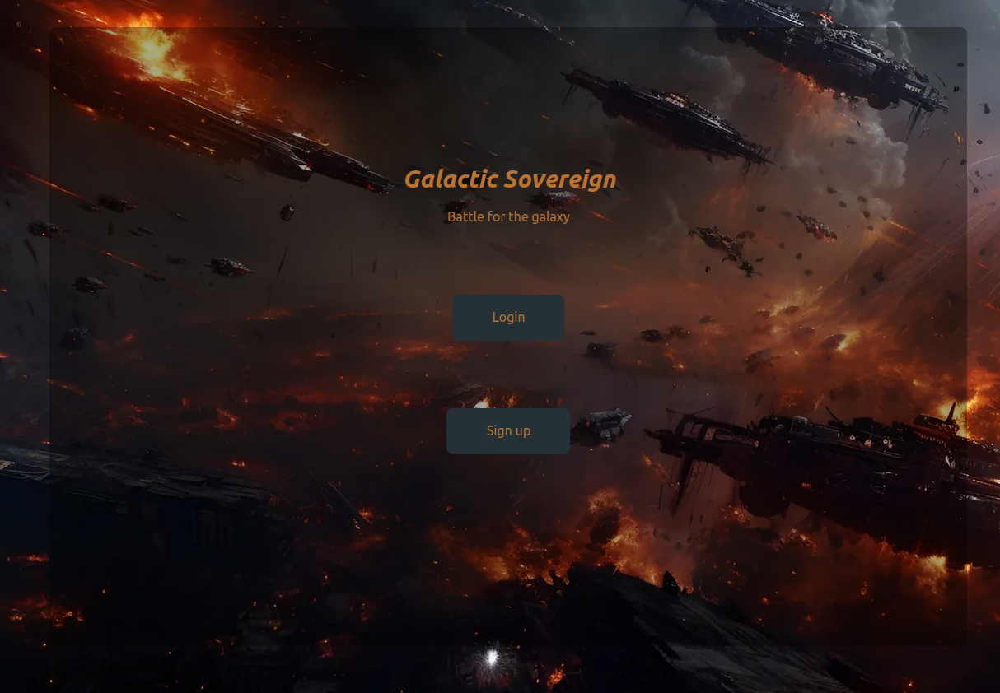
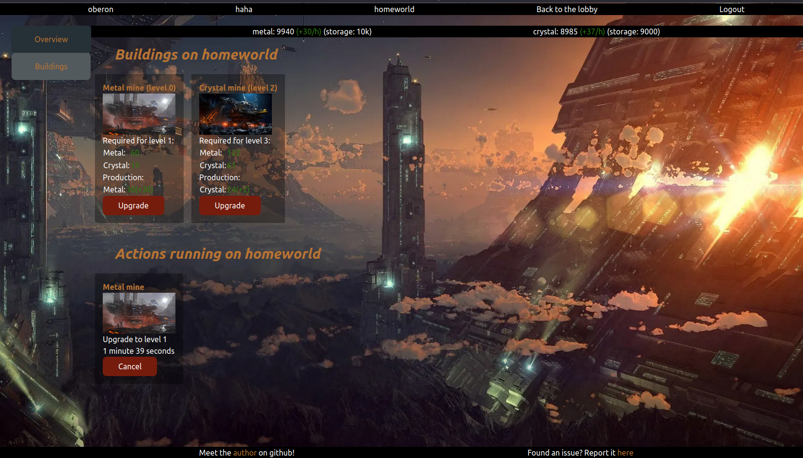

# galactic-sovereign-frontend

This project holds the website for the [Galactic Sovereign](https://galactic-sovereign.gasteropo.de) browser game. It is backed by the [galactic-sovereign](https://github.com/Knoblauchpilze/galactic-sovereign) service.

The project is working and deployed already but provide minimal features. You can play the game and there's a persistent server allowing people to run their account as they wish. Some screenshots are available below:





# Badges

[](https://github.com/Knoblauchpilze/galactic-sovereign-frontend/actions/workflows/build-and-push.yml)

[](https://codecov.io/gh/Knoblauchpilze/galactic-sovereign-frontend)

# Installation

## Prerequisites

This project requires the following tools to be installed on your machine:
* [node](https://nodejs.org/en/download)
* [docker](https://docs.docker.com/engine/install/ubuntu/) (for Ubuntu, but can be adapted for other OS)

## Setup the repository

Once this is done, you can clone the repository locally:

```bash
git clone git@github.com:Knoblauchpilze/galactic-sovereign-frontend.git
```

After this you can install the dependencies and start the preview of the website:
```bash
cd /path/to/the/repo
make instal
make dev
```

This should open a new tab in your browser with the website.

## Additional information

This project was generated from the [template-frontend](https://github.com/Knoblauchpilze/template-frontend) project. It also uses the [frontend-toolkit](https://github.com/Knoblauchpilze/frontend-toolkit) to interact with the backend service.

# What is the goal of this project?

## Context

This project initially started as a companion project to the [user-service](https://github.com/Knoblauchpilze/user-service) backend service. The goal was to make this service available by deploying it to an instance in the cloud. From there it made sense to add some frontend to visualize the data.

As the project developed, we extended the code contained in the repository to include the creation of a game based on what was done in [sogclient](https://github.com/Knoblauchpilze/sogclient), integrating it in what is essentially a monorepo.

After some time, it became quite cumbersome to maintain this repository. In order to improve the sitiation we extracted this service, along with some other ones to their dedicated repository.

The companion backend service is available at [galactic-sovereign](https://github.com/Knoblauchpilze/galactic-sovereign).

## Which web framework is used?

In the past, we used [react](https://react.dev/learn) for the [sogclient](https://github.com/Knoblauchpilze/sogclient) project. This was quite powerful but also very complex to get to work.

After a bit of research, we stumbled upon the [Svelte](https://kit.svelte.dev/docs/introduction) framework: this seems to be relatively lightweight.

Taken from the [documentation](https://kit.svelte.dev/docs/routing#page-page-svelte), the routing is done through a file system structure. Generally speaking, to build a page with a certain route, you can create:
- `path/to/page.ts`: this allows to fetch data from remote source before the page is loaded.
- `path/to/page.svelte`: this defines the html content of the page and can access whatever was returned from the `page.ts`.
- `path/to/page.server.ts`: this defines the server side code to execute when serving the page before it's loaded on the client.
- `path/to/layout.svelte`: allows to define a common layout applying to all pages below the current path and inheriting from the parent layouts.

It is also a full-stack framework, meaning that it serves both the client side (i.e. the pages that the user will see on their browser) and the backend (i.e. the code to serve the pages that will be sent to users).

In out case the later part will be 'underutilized' as we anyway already have our backend in the form of the go application. That being said it is nice to save some logic already to serve the pages. Also, it allows to not expose some of our services to the outside world by segregating which loading processes are done in the backend and which ones are done in the frontend.

## Future development

This is not the first time that we attempt to build a clone of [Ogame](https://lobby.ogame.gameforge.com/en_GB/). The first attempt is split into the following two repositories:
* server over at [sogserver](https://github.com/Knoblauchpilze/sogserver)
* client over at [sogclient](https://github.com/Knoblauchpilze/sogclient)

But we did not deploy those two projects anywhere. This project already goes a bit further as there **is** a permanent server running. What is missing is that the capabilities available in the `sogserver` are more developed than what is available in the backend here (see [galactic-sovereign](https://github.com/Knoblauchpilze/galactic-sovereign)).

The logic is better designed in the new service though. The main difference is that the business logic is not included in the database scripts.

# Generalities on the deployment of the website

Building a website is quite a tricky topic, and deploying it even more. There were a lot of learnings along the way and the salient points seem to be the following:
- we need a domain name.
- we need a way to attach the domain name to the actual server hosting the website.
- we need some certificates to allow our users to be reassured by a nice `https://` address.

## Production build

Deploying the website so that it can be accessed by users requires two components:
- the server which will handle the requests and serve the pages.
- the pages that are served to the users.

It also requires quite a lot of other things as described in this [reddit post](https://www.reddit.com/r/webdev/s/gEqYH5T0pg) but this would be the basics.

This [svelte doc page](https://kit.svelte.dev/docs/adapter-node) explains how to package everything for a node environment. This [page](https://kit.svelte.dev/docs/adapters) provides more information about the process in general.

The idea is to first build the code into production-ready artifacts with:

```bash
make build
```

It is then possible to start the server locally with:

```bash
ORIGIN=http://localhost:3000 node /path/to/the/build/folder
```

The first part corresponds to the problem described in this [SO post](https://stackoverflow.com/questions/73790956/cross-site-post-form-submissions-are-forbidden). With this, the website can be accessed locally on the browser by going to `http://localhost:3000/dashboard/login`.

For convenience, the [Makefile](Makefile) defines a `build` target to handle the build. Alternatively you can also use the `docker` target in the same `Makefile` to build the docker images for the frontend: this handles everything and allows to predictably setup the associated web server.

## The domain name

There are multiple providers to buy a domain name from. We found this [SO link](https://webmasters.stackexchange.com/questions/8804/where-is-the-best-place-to-buy-domain-names-and-how-much-should-i-pay) to guide us towards a provider. Once the domain is bought, we also get (not always) subdomains for free. This is pretty cool as it means we can segregate our applications and services without spending more money.

## Attach the domain to an instance

Depending on what kind of hosting is done for the website attaching a domain to an instance might take different forms. At first, we found these links ([1](https://medium.com/@yashpatel007/how-to-connect-your-amazon-ec2-instance-with-a-domain-name-80ad8959078) and [2](https://techgenix.com/namecheap-aws-ec2-linux/)): this involves creating some entries in the `Route53` from AWS and also to attach an elastic IP (v4) to the server. This seems interesting and we tried it out at first.

However some problems arised when trying to activate subdomains. This [post from Namecheap](https://www.namecheap.com/support/knowledgebase/article.aspx/9776/2237/how-to-create-a-subdomain-for-my-domain/) indicates that we can't benefit from subdomains when custom DNS servers are used. This would be the case in case we use `Route53` as the DNS for our website.

Fortunately Namecheap also offers such services and also supports IPv6. A second approach we followed is described in [this knowledge base](https://www.namecheap.com/support/knowledgebase/article.aspx/434/2237/how-do-i-set-up-host-records-for-a-domain/) article to directly add the A(AAA) record for the server. 
