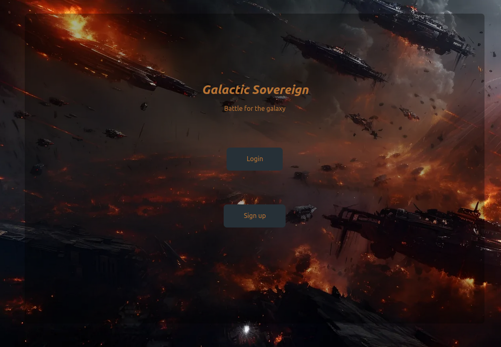
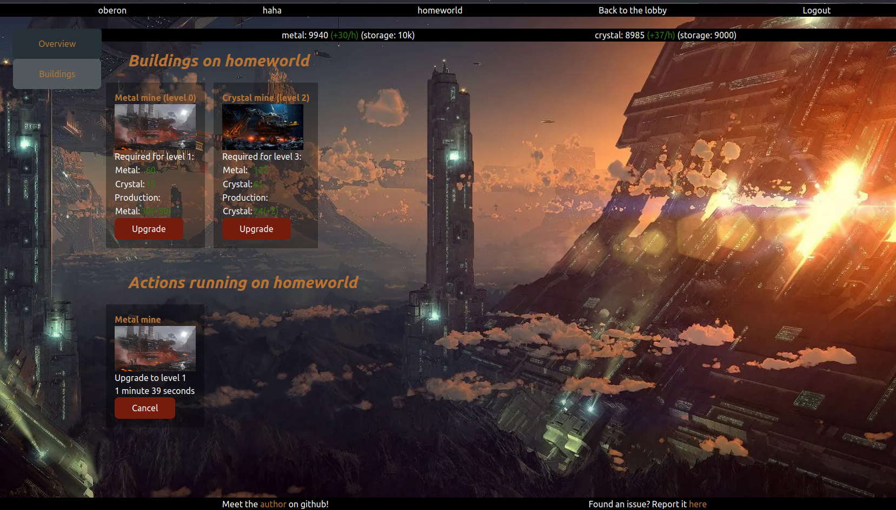

# galactic-sovereign-frontend

This project holds the website for the [Galactic Sovereign](https://galactic-sovereign.gasteropo.de) browser game. It is backed by the [galactic-sovereign](https://github.com/Knoblauchpilze/galactic-sovereign) service.

The project is working and deployed already but provide minimal features. You can play the game and there's a persistent server allowing people to run their account as they wish. Some screenshots are available below:





# Badges

[](https://github.com/Knoblauchpilze/galactic-sovereign-frontend/actions/workflows/build-and-push.yml)

[](https://codecov.io/gh/Knoblauchpilze/galactic-sovereign-frontend)

# Installation

## Prerequisites

This project requires the following tools to be installed on your machine:
* [node](https://nodejs.org/en/download)
* [docker](https://docs.docker.com/engine/install/ubuntu/) (for Ubuntu, but can be adapted for other OS)

## Setup the repository

Once this is done, you can clone the repository locally:

```bash
git clone git@github.com:Knoblauchpilze/galactic-sovereign-frontend.git
```

After this you can install the dependencies and start the preview of the website:
```bash
cd /path/to/the/repo
make instal
make dev
```

